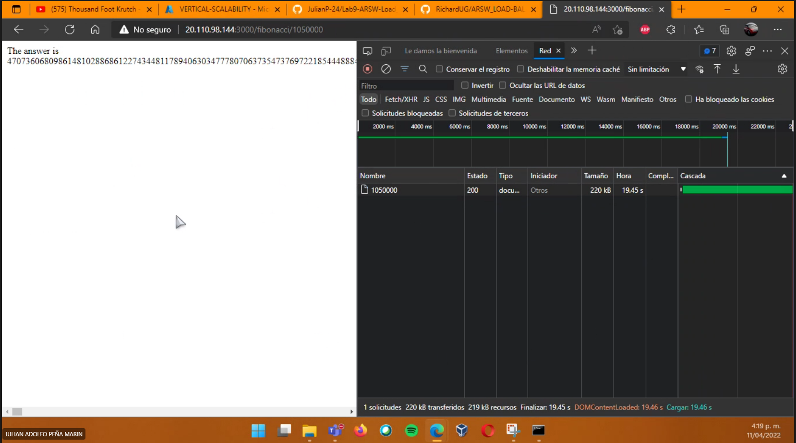
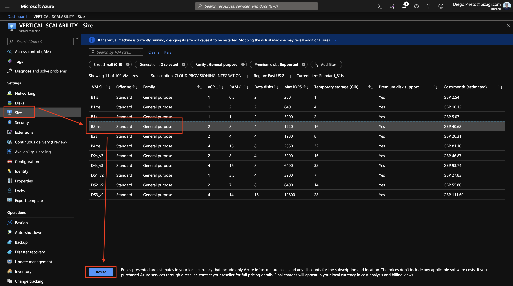

### Escuela Colombiana de Ingeniería
### Arquitecturas de Software - ARSW

## Escalamiento en Azure con Maquinas Virtuales, Sacale Sets y Service Plans

### Dependencias
* Cree una cuenta gratuita dentro de Azure. Para hacerlo puede guiarse de esta [documentación](https://azure.microsoft.com/es-es/free/students/). Al hacerlo usted contará con $100 USD para gastar durante 12 meses.

### Parte 0 - Entendiendo el escenario de calidad

Adjunto a este laboratorio usted podrá encontrar una aplicación totalmente desarrollada que tiene como objetivo calcular el enésimo valor de la secuencia de Fibonnaci.

**Escalabilidad**
Cuando un conjunto de usuarios consulta un enésimo número (superior a 1000000) de la secuencia de Fibonacci de forma concurrente y el sistema se encuentra bajo condiciones normales de operación, todas las peticiones deben ser respondidas y el consumo de CPU del sistema no puede superar el 70%.

### Parte 1 - Escalabilidad vertical

1. Diríjase a el [Portal de Azure](https://portal.azure.com/) y a continuación cree una maquina virtual con las características básicas descritas en la imágen 1 y que corresponden a las siguientes:
    * Resource Group = SCALABILITY_LAB
    * Virtual machine name = VERTICAL-SCALABILITY
    * Image = Ubuntu Server 
    * Size = Standard B1ls
    * Username = scalability_lab
    * SSH publi key = Su llave ssh publica


* Primero creamos la maquina virtual con las especificaciones dadas


2. Para conectarse a la VM use el siguiente comando, donde las `x` las debe remplazar por la IP de su propia VM (Revise la sección "Connect" de la virtual machine creada para tener una guía más detallada).

    `ssh scalability_lab@xxx.xxx.xxx.xxx`
	
	* Para poder conectarnos a la maquina, nos dirigimos a la pestaña de connect, dentro de la maquina virtual y seleccionamos SSH
	
	
	
	* Despues abrimos una terminal en la misma ruta en donde tengamos descargada la llave que se genero anteriormente para poder conectarse
	
	
	
	* En la terminal ponemos el comando que da azure para conectarse por SSH, accediendo a la maquina virtual
	
	
	

3. Instale node, para ello siga la sección *Installing Node.js and npm using NVM* que encontrará en este [enlace](https://linuxize.com/post/how-to-install-node-js-on-ubuntu-18.04/).
4. Para instalar la aplicación adjunta al Laboratorio, suba la carpeta `FibonacciApp` a un repositorio al cual tenga acceso y ejecute estos comandos dentro de la VM:

    `git clone <your_repo>`
	
	

    `cd <your_repo>/FibonacciApp`

    `npm install`
	
	

5. Para ejecutar la aplicación puede usar el comando `npm FibinacciApp.js`, sin embargo una vez pierda la conexión ssh la aplicación dejará de funcionar. Para evitar ese compartamiento usaremos *forever*. Ejecute los siguientes comando dentro de la VM.

    ` npm install forever -g`
	
	` forever start FibinacciApp.js`

6. Antes de verificar si el endpoint funciona, en Azure vaya a la sección de *Networking* y cree una *Inbound port rule* tal como se muestra en la imágen. Para verificar que la aplicación funciona, use un browser y user el endpoint `http://xxx.xxx.xxx.xxx:3000/fibonacci/6`. La respuesta debe ser `The answer is 8`.


 * Iniciamos la aplicacion en la maquina virtual
   
  
 * Verificamos en el navegador, que este funcionando obteniendo como respuesta 8
   
  
 * Revisamos la consola de la maquina virtual
   


7. La función que calcula en enésimo número de la secuencia de Fibonacci está muy mal construido y consume bastante CPU para obtener la respuesta. Usando la consola del Browser documente los tiempos de respuesta para dicho endpoint usando los siguintes valores:
    * 1000000
	Se demnoro 17,04 segundos
	
	
	
    * 1010000
	Se demnoro 17,7 segundos
	
	
    * 1020000
		Se demnoro 18,04 segundos
	
	
    * 1030000
			Se demnoro 18,55 segundos
	
    * 1040000
		Se demnoro 19,15 segundos
	
    * 1050000
			Se demnoro 19,45 segundos
	
    * 1060000
		Se demnoro 19,73 segundos
	
    * 1070000
		Se demnoro 20,31 segundos
	
    * 1080000
		Se demnoro 20,63 segundos
	
    * 1090000    
		Se demnoro 21,08 segundos
	

8. Dírijase ahora a Azure y verifique el consumo de CPU para la VM. (Los resultados pueden tardar 5 minutos en aparecer).

	


9. Ahora usaremos Postman para simular una carga concurrente a nuestro sistema. Siga estos pasos.
    * Instale newman con el comando `npm install newman -g`. Para conocer más de Newman consulte el siguiente [enlace](https://learning.getpostman.com/docs/postman/collection-runs/command-line-integration-with-newman/).
		
    * Diríjase hasta la ruta `FibonacciApp/postman` en una maquina diferente a la VM.
    * Para el archivo `[ARSW_LOAD-BALANCING_AZURE].postman_environment.json` cambie el valor del parámetro `VM1` para que coincida con la IP de su VM.
	
    * Ejecute el siguiente comando.

    ```
    newman run ARSW_LOAD-BALANCING_AZURE.postman_collection.json -e [ARSW_LOAD-BALANCING_AZURE].postman_environment.json -n 10 &
    newman run ARSW_LOAD-BALANCING_AZURE.postman_collection.json -e [ARSW_LOAD-BALANCING_AZURE].postman_environment.json -n 10
    ```

10. La cantidad de CPU consumida es bastante grande y un conjunto considerable de peticiones concurrentes pueden hacer fallar nuestro servicio. Para solucionarlo usaremos una estrategia de Escalamiento Vertical. En Azure diríjase a la sección *size* y a continuación seleccione el tamaño `B2ms`.




11. Una vez el cambio se vea reflejado, repita el paso 7, 8 y 9.
    * 1000000
	Se demnoro 14,55 segundos
	
	
	
    * 1010000
	Se demnoro 14,92 segundos
	
	
    * 1020000
		Se demnoro 15,09 segundos
	
	
    * 1030000
			Se demnoro 15,51 segundos
	
    * 1040000
		Se demnoro 15,57 segundos
	
    * 1050000
		Se demnoro 16,34 segundos
	
    * 1060000
		Se demnoro 16,17 segundos
	
    * 1070000
		Se demnoro 16,46 segundos
	
    * 1080000
			Se demnoro 16,82 segundos
	

    * 1090000    
			Se demnoro 16,93 segundos
	

    * Verificamos el consumo en informacion general
	
	
		

12. Evalue el escenario de calidad asociado al requerimiento no funcional de escalabilidad y concluya si usando este modelo de escalabilidad logramos cumplirlo.

13. Vuelva a dejar la VM en el tamaño inicial para evitar cobros adicionales.

**Preguntas**

1. ¿Cuántos y cuáles recursos crea Azure junto con la VM?
   
2. ¿Brevemente describa para qué sirve cada recurso?
   * Disco virtual: Se ultiliza para el almacenamiento de datos 
   * Clave SSH: Es la clave de conexión para el acceso remoto al servicio 
   * Interfaz de red: Sirve para señalar la conexión que se da de manera física, entre los dispositivos y el sistema 
   * Grupo de seguridad de red: Se utiliza para filtrar el tráfico de la red 
   * Dirección IP pública: Permite acceder a la vm y a conexiones 
   * Red virtual: Es la red vlan que se crea para darle conexión a la maquina virtual 
   * Network watcher: Es un observador el cual administra el trafico externo de la red
3. ¿Al cerrar la conexión ssh con la VM, por qué se cae la aplicación que ejecutamos con el comando `npm FibonacciApp.js`? ¿Por qué debemos crear un *Inbound port rule* antes de acceder al servicio?

   * Si se utiliza el comando npm FibonacciApp.js y la máquina se suspende por inactividad, la aplicación dejaría de correr, al igual que si existe un error en la  máquina virtual. Por eso se utiliza forever start FibonacciApp.js.

   * El Inbound port rule sirve para permitir la entrada al servicio que se está levantando. En este caso la aplicación corre por el puerto 3000, así que es este el que se debe abrir.

4. Adjunte tabla de tiempos e interprete por qué la función tarda tando tiempo.

   * Tabla de los tiempos dados con el tamaño de la maquina en b1ls 
   
     Para este caso la funcion tarda mucho debido a la capacidad de procesamiento dada por el tamaño de la maquina que esta tiene.
  
     
  
   * Tabla de los tiempos dados con el tamaño de la maquina en b2ms
   
     En este caso se nota una mejora en cuanto al tiempo ya que al cambiar de tamaño de b1ls a b2ms, la capacidad de procesamiento mejoro en comparacion al anterior. Esto porque 
	 b2ms tiene mas RAM y mas almacenamiento que b1ls.
  
     

5. Adjunte imágen del consumo de CPU de la VM e interprete por qué la función consume esa cantidad de CPU.

	
	
6. Adjunte la imagen del resumen de la ejecución de Postman. Interprete:
    * Tiempos de ejecución de cada petición.
    * Si hubo fallos documentelos y explique.
	
	* Tamaño estandar b1ls
	
	  En este caso como podemos ovservar en la imagen, el tiempo de ejecucion realizado por las pruabas newman fue de 3 minutos con 22s y muestra fallos en 4 de las 10 peticiones
	  realizadas. Estos fallos se deben a que generan un alto consumo y por la capacidad de la maquina genere un error. Adicionalmente se puede observar la media del tiempo de 
	  respuesta que en este caso fueron 29,1s, de igual forma el tiempo minimo y maximo.
	
	  
	
	* Tamaño estandar b2ms
	
	  En este caso como podemos ovservar en la imagen, el tiempo de ejecucion realizado por las pruabas newman fue de 2 minutos con 41s, lo cual se redujo considerablemente, esto por que al realizar 
	  el cambio de tamaño de la maquina a b2ms, esta consiguio mas RAM y mas almacenamiento. De igual forma muestra fallos en 4 de las 10 peticiones realizadas. Estos fallos se deben a que 
	  generan una alta concurrencia, aun asi la maquina tenga mejor capacidad que en comparacion con la prueba anterior. Adicionalmente se puede observar la media del tiempo de respuesta que en este caso  
	  fueron 18,1s y el tiempo minimo y maximo.
	
	  
	
7. ¿Cuál es la diferencia entre los tamaños `B2ms` y `B1ls` (no solo busque especificaciones de infraestructura)?

   * Los de la serie B solo funcionan en linux 
   * B2ms: Tiene 2 vCPUs, 8 GB de RAM, 1 data disk y cuesta $ 60.74 dólares mensuales.
   * B1ls: Tiene 1 vCPUs, 0.5 GB de RAM, 1 data disk y cuesta $ 3.80 dólares mensuales.

8. ¿Aumentar el tamaño de la VM es una buena solución en este escenario?, ¿Qué pasa con la FibonacciApp cuando cambiamos el tamaño de la VM?
   * Si bien aumentar la capacidad de procesamiento a la máquina ayuda a bajar el tiempo de ejecución de la aplicación, no fue un cambio tan significativo, y la relacion costo beneficio de la maquina B1LS no se compara a la B2ms 


9. ¿Qué pasa con la infraestructura cuando cambia el tamaño de la VM? ¿Qué efectos negativos implica?

   * Puede generar sobrecostos donde no se tenga claro la capacidad que se requiere 

10. ¿Hubo mejora en el consumo de CPU o en los tiempos de respuesta? Si/No ¿Por qué?

    * Se nota una leve mejora en cuanto a los calculos y en cuanto al uso de la CPU, este se vio disminuido 
	
11. Aumente la cantidad de ejecuciones paralelas del comando de postman a `4`. ¿El comportamiento del sistema es porcentualmente mejor?

    * El comportamiento si es porcentualmente mejor ya que presenta menos fallos.

### Parte 2 - Escalabilidad horizontal

#### Crear el Balanceador de Carga

Antes de continuar puede eliminar el grupo de recursos anterior para evitar gastos adicionales y realizar la actividad en un grupo de recursos totalmente limpio.

1. El Balanceador de Carga es un recurso fundamental para habilitar la escalabilidad horizontal de nuestro sistema, por eso en este paso cree un balanceador de carga dentro de Azure tal cual como se muestra en la imágen adjunta.


Primero vamos a crear el balanceador de carga, con la informacion necesaria


2. A continuación cree un *Backend Pool*, guiese con la siguiente imágen.


Para poder crear un Backen Pool, toca primero crear una red virtual para eso nos dirigimos al paso numero 5, antes de continuar con este

Despues nos dirigimos al grupo de recursos y despues a grupos backend y le damos agregar


3. A continuación cree un *Health Probe*, guiese con la siguiente imágen.


Nos dirigimos al grupo de recursos y despues a sondeo de estados y le damos agregar


4. A continuación cree un *Load Balancing Rule*, guiese con la siguiente imágen.


Nos dirigimos al grupo de recursos y despues a reglas de equilibrio de carga y le damos agregar


5. Cree una *Virtual Network* dentro del grupo de recursos, guiese con la siguiente imágen.


#### Crear las maquinas virtuales (Nodos)

Ahora vamos a crear 3 VMs (VM1, VM2 y VM3) con direcciones IP públicas standar en 3 diferentes zonas de disponibilidad. Después las agregaremos al balanceador de carga.

1. En la configuración básica de la VM guíese por la siguiente imágen. Es importante que se fije en la "Avaiability Zone", donde la VM1 será 1, la VM2 será 2 y la VM3 será 3.


A continuacion se van a crear tres maquinas virtuales, con la unica deferencia en que la zona de disponibilidad no es la misma


El proceso es lo mismo para las otras dos maquinas virtuales

2. En la configuración de networking, verifique que se ha seleccionado la *Virtual Network*  y la *Subnet* creadas anteriormente. Adicionalmente asigne una IP pública y no olvide habilitar la redundancia de zona.


Verificamos que la red virtual y sub red seleccionada sea la correcta


3. Para el Network Security Group seleccione "avanzado" y realice la siguiente configuración. No olvide crear un *Inbound Rule*, en el cual habilite el tráfico por el puerto 3000. Cuando cree la VM2 y la VM3, no necesita volver a crear el *Network Security Group*, sino que puede seleccionar el anteriormente creado.


Ahora pasamos a crear el grupo de seguridad, con la informacion necesaria


4. Ahora asignaremos esta VM a nuestro balanceador de carga, para ello siga la configuración de la siguiente imágen.


   * Asignacion de la maquina virtual 1 (VM1) al balanceador de carga
   
   
   Repetimos el mismo procedimiento para las otras dos maquinas virtuales

5. Finalmente debemos instalar la aplicación de Fibonacci en la VM. para ello puede ejecutar el conjunto de los siguientes comandos, cambiando el nombre de la VM por el correcto

```
git clone https://github.com/daprieto1/ARSW_LOAD-BALANCING_AZURE.git

curl -o- https://raw.githubusercontent.com/creationix/nvm/v0.34.0/install.sh | bash
source /home/vm1/.bashrc
nvm install node

cd ARSW_LOAD-BALANCING_AZURE/FibonacciApp
npm install

npm install forever -g
forever start FibonacciApp.js
```

Realice este proceso para las 3 VMs, por ahora lo haremos a mano una por una, sin embargo es importante que usted sepa que existen herramientas para aumatizar este proceso, entre ellas encontramos Azure Resource Manager, OsDisk Images, Terraform con Vagrant y Paker, Puppet, Ansible entre otras.

#### Probar el resultado final de nuestra infraestructura

1. Porsupuesto el endpoint de acceso a nuestro sistema será la IP pública del balanceador de carga, primero verifiquemos que los servicios básicos están funcionando, consuma los siguientes recursos:

```
http://52.155.223.248/
http://52.155.223.248/fibonacci/1
```

Verificamos accediendo a nuestra ip publica del balanceador de carga la cual es http://20.223.2.24/fibonacci/1, con lo cual obtenemos el siguiente resultado


2. Realice las pruebas de carga con `newman` que se realizaron en la parte 1 y haga un informe comparativo donde contraste: tiempos de respuesta, cantidad de peticiones respondidas con éxito, costos de las 2 infraestrucruras, es decir, la que desarrollamos con balanceo de carga horizontal y la que se hizo con una maquina virtual escalada.

3. Agregue una 4 maquina virtual y realice las pruebas de newman, pero esta vez no lance 2 peticiones en paralelo, sino que incrementelo a 4. Haga un informe donde presente el comportamiento de la CPU de las 4 VM y explique porque la tasa de éxito de las peticiones aumento con este estilo de escalabilidad.

```
newman run ARSW_LOAD-BALANCING_AZURE.postman_collection.json -e [ARSW_LOAD-BALANCING_AZURE].postman_environment.json -n 10 &
newman run ARSW_LOAD-BALANCING_AZURE.postman_collection.json -e [ARSW_LOAD-BALANCING_AZURE].postman_environment.json -n 10 &
newman run ARSW_LOAD-BALANCING_AZURE.postman_collection.json -e [ARSW_LOAD-BALANCING_AZURE].postman_environment.json -n 10 &
newman run ARSW_LOAD-BALANCING_AZURE.postman_collection.json -e [ARSW_LOAD-BALANCING_AZURE].postman_environment.json -n 10
```

**Preguntas**

* ¿Cuáles son los tipos de balanceadores de carga en Azure y en qué se diferencian?

   Existen dos tipos de balanceadores en azure:
   * Balanceador de carga publico: Proporciona conexiones de salida para máquinas virtuales dentro de la red virtual. Estas conexiones se realizan mediante la traducción de sus direcciones IP privadas a direcciones IP públicas.
   * Balanceador de carga interno(privado): se usa cuando se necesitan direcciones IP privadas solo en el front-end. Los equilibradores de carga internos se usan para equilibrar la carga del tráfico dentro de una red virtual. También se puede acceder a un servidor front-end del equilibrador de carga desde una red local en un escenario híbrido.
   
* ¿Qué es SKU, qué tipos hay y en qué se diferencian? 

  El Azure Container Registry está disponible en varios niveles de servicio (también conocidos como SKU). Estos niveles ofrecen precios predecibles y varias opciones para alinearse con la capacidad y los patrones de uso de su registro de Docker privado en Azure.
  Existen tres niveles, los cuales son:
  
  * Basico: Un punto de entrada optimizado para los costos para que los desarrolladores aprendan sobre Azure Container Registry. Los registros básicos tienen las mismas funcionalidades de programación que Estándar y Premium (como integración de la autenticación de Azure Active Directory, la eliminación de imágenes y webhooks). Sin embargo, el almacenamiento incluido y el rendimiento de las imágenes son más adecuadas para escenarios de uso inferior.
  * Estandar: Los registros estándar ofrecen las mismas funcionalidades que los básicos, pero con más almacenamiento y un mayor rendimiento de las imágenes. Los registros estándar deberían satisfacer las necesidades de la mayoría de los escenarios de producción.
  * Premium: Los registros premium proporcionan la mayor cantidad de almacenamiento incluido y operaciones simultáneas, por lo que permiten trabajar con escenarios de mayor volumen. Además de la mayor capacidad de rendimiento de las imágenes, el nivel Premium agrega características tales como replicación geográfica para la administración de un único registro en varias regiones, confianza del contenido para la firma de etiquetas de imagen, y vínculo privado con puntos de conexión privados para restringir el acceso al Registro.
  
* ¿Por qué el balanceador de carga necesita una IP pública?

  Se necesita un ip publica, ya que con esa IP es lo que el servidor DNS usara para resolver el acceso al sitio web. Esta direccion de IP publica actua como direccion IP de carga equilibrada.
  
* ¿Cuál es el propósito del *Backend Pool*?
  
  Un grupo de back-end en Front Door hace referencia al conjunto de back-end que reciben tráfico similar para las aplicaciones. En otras palabras, es una agrupación lógica de las instancias de aplicación en todo el mundo que reciben el mismo tráfico y responden con 
  el comportamiento esperado. Un grupo de back-end define cómo se deben evaluar los diferentes back-end a través de los sondeos de estado. También define cómo se produce el equilibrio de carga entre ellos.
  
* ¿Cuál es el propósito del *Health Probe*?

  Un sondeo de estado tiene como objetivo detectar el estado del punto de conexión. La configuración del sondeo de estado y las respuestas de sondeo determinan qué instancias del grupo de back-end recibirán nuevas conexiones. Use sondeos de estado para detectar el error de una aplicación. Genere una respuesta personalizada a un sondeo de estado. Use el sondeo de estado para el control de flujo para administrar la carga o el tiempo de inactividad planeado. Cuando se genera un error en el sondeo de estado, el equilibrador de carga deja de enviar nuevas conexiones a la instancia con estado incorrecto respectiva. La conectividad saliente no se ve afectada, solo la entrante.

* ¿Cuál es el propósito de la *Load Balancing Rule*? 

  Se usa para definir cómo se distribuye el tráfico entrante a todas las instancias del grupo de back-end. Las reglas de equilibrio de carga asignan una configuración de IP de front-end y un puerto determinados a varios puertos y direcciones IP de back-end. Un ejemplo sería una regla creada en el puerto 80 para equilibrar la carga del tráfico web.
  
* ¿Qué tipos de sesión persistente existen, por qué esto es importante y cómo puede afectar la escalabilidad del sistema?.
   
* ¿Qué es una *Virtual Network*? 

  Azure Virtual Network (VNet) es el bloque de creación fundamental de una red privada en Azure. VNet permite muchos tipos de recursos de Azure, como Azure Virtual Machines (máquinas virtuales), para comunicarse de forma segura entre usuarios, con Internet y con las redes locales. VNet es similar a una red tradicional que funcionaría en su propio centro de datos, pero aporta las ventajas adicionales de la infraestructura de Azure, como la escala, la disponibilidad y el aislamiento.
  
* ¿Qué es una *Subnet*? 

  Una Subnet permite segmentar la red virtual en una o más subnets y además asignarles una parte del espacio de direcciones de la red virtual de cada subnet, además se pueden implementar recursos que se han creado en Azure en una subnet específica.
  
* ¿Para qué sirven los *address space* y *address range*?
  
  * Address space: Se debe especificar un espacio de direcciones IP privadas personalizadas mediante direcciones públicas y privadas (RFC 1918). Azure asigna a los recursos de una red virtual una dirección IP privada del espacio de direcciones que asigne. 
  * Address range: Puede ser público o privado (RFC 1918). Ya sea que defina el intervalo de direcciones como público o privado, solo se puede acceder al intervalo de direcciones desde la red virtual, desde las redes virtuales interconectadas y desde cualquier red local que haya conectado a la red virtual. 

* ¿Qué son las *Availability Zone* y por qué seleccionamos 3 diferentes zonas?. 

  * Son ubicaciones aisladas de errores en una región de Azure que proporcionan alimentación, refrigeración y funcionalidad de red redundantes. Estas zonas permiten ejecutar aplicaciones críticas con alta disponibilidad y tolerancia a errores en los centros de datos.
  * Se dividen en tres diferentes zonas para proteger las aplicaciones y los datos de fallos en el data center, de igual forma se ofrece un acuerdo de nivel de servicio del 99,99 % con respaldo financiero para las máquinas virtuales implementadas en dos o más zonas de una región cuando el servicio esté disponible con carácter general.

* ¿Qué significa que una IP sea *zone-redundant*?

  Los servicios de zona redudante hacen que la plataforma se replique automáticamnete en todas las zonas.
  
* ¿Cuál es el propósito del *Network Security Group*?

  Un grupo de seguridad de red contiene reglas de seguridad que permiten o deniegan el tráfico de red entrante o el tráfico de red saliente de varios tipos de recursos de Azure. Para cada regla, puede especificar un origen y destino, un puerto y un protocolo.
  
* Informe de newman 1 (Punto 2)
* Presente el Diagrama de Despliegue de la solución.


